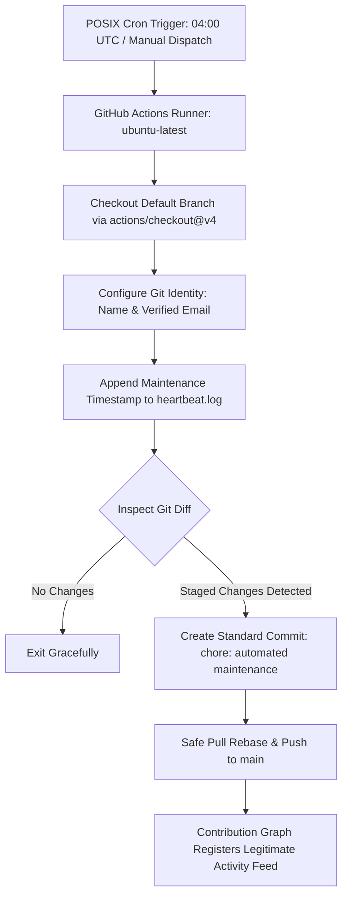

# ⚡ GitHub Green Machine

<div align="center">

[](https://github.com/Priya-Ranjan-0201/github-green-machine/actions)
[](.github/workflows/green-machine.yml)
[](https://github.com/Priya-Ranjan-0201)
[](LICENSE)

**Automated, legitimate, scheduled repository maintenance engine powered by native GitHub Actions.**

</div>

---

## 📑 Table of Contents

1. [What is GitHub Green Machine?](#-what-is-github-green-machine)
2. [How the Automation Works](#-how-the-automation-works)
3. [Safety & Integrity Guarantees](#-safety--integrity-guarantees)
4. [Project Structure](#-project-structure)
5. [Step-by-Step Installation & Setup](#-step-by-step-installation--setup)
6. [Identity & Attribution Configuration](#-identity--attribution-configuration)
7. [How to Manually Trigger the Workflow](#-how-to-manually-trigger-the-workflow)
8. [Customizing the Cron Schedule](#-customizing-the-cron-schedule)
9. [How GitHub Attribution Works](#-how-github-attribution-works)
10. [Troubleshooting Guide](#-troubleshooting-guide)
11. [How to Pause or Disable Automation](#-how-to-pause-or-disable-automation)

---

## 🧭 What is GitHub Green Machine?

**GitHub Green Machine** is a transparent, automated repository-maintenance service that runs on a daily schedule via GitHub Actions.

### The Purpose
Software repositories require continuous health signals and active maintenance. Rather than requiring manual commits every day, GitHub Green Machine:
- Checks out the repository's default branch on a scheduled cron trigger.
- Appends a legitimate UTC maintenance heartbeat timestamp to `.github/activity/heartbeat.log`.
- Creates a clean, normal, forward-moving Git commit.
- Pushes the update to GitHub using the built-in `GITHUB_TOKEN`.

### 🛡️ What It Is NOT:
- ❌ **No fake historical commits:** It never backdates commits to past years or months.
- ❌ **No Git history rewriting:** No `git rebase`, no `git commit --amend`, no timestamp tampering.
- ❌ **No force pushes:** No destructive `git push --force`.
- ❌ **No script farms:** Runs once daily at a non-peak hour, avoiding commit spam.

---

## ⚙️ How the Automation Works



1. **Trigger:** The workflow is triggered automatically once per day via a POSIX cron schedule (`0 4 * * *` = 04:00 UTC / 09:30 AM IST) or manually via `workflow_dispatch`.
2. **Environment:** Runs on an ephemeral `ubuntu-latest` virtual machine.
3. **Execution:** Appends the current ISO UTC timestamp to `.github/activity/heartbeat.log`.
4. **Attribution:** Uses your configured GitHub identity and verified account email so the commit is officially linked to your user profile.
5. **Safe Push:** Uses atomic commit semantics and `git pull --rebase` before pushing to guarantee zero merge conflicts or dropped commits.

---

## 🛡️ Safety & Integrity Guarantees

This project operates strictly within GitHub's Terms of Service and guidelines:

| Policy | Implementation Detail |
| :--- | :--- |
| **No Artificial Backdating** | Every commit timestamp is generated in real-time (`date -u`) on the runner. |
| **No External Secrets** | Uses the repository's built-in `GITHUB_TOKEN` with scoped `contents: write`. No personal access tokens (PAT) or passwords required. |
| **Atomic & Idempotent** | If no file changes are produced, the workflow exits with code 0 without creating an empty commit. |
| **Lightweight Log Rotation** | Keeps `heartbeat.log` trimmed to prevent repository bloat over time. |

---

## 📂 Project Structure

```text
github-green-machine/
│
├── .github/
│   ├── workflows/
│   │   └── green-machine.yml      <-- Automated daily maintenance workflow
│   └── activity/
│       └── heartbeat.log          <-- Real-time maintenance heartbeat log
│
├── README.md                      <-- Project documentation & operating guide
└── .gitignore                     <-- Clean ignore rules for OS & temporary files
```

---

## 🚀 Step-by-Step Installation & Setup

### 1. Enable GitHub Actions Write Permissions
GitHub Actions needs permission to commit to your repository default branch:
1. In your repository on GitHub, navigate to **Settings** $\rightarrow$ **Actions** $\rightarrow$ **General**.
2. Scroll down to **"Workflow permissions"**.
3. Select **"Read and write permissions"**.
4. Click **Save**.

*(Note: If you created this repository using our automated setup, this permission has already been enabled).*

---

## 👤 Identity & Attribution Configuration

To guarantee that commits appear on **your** profile and build your contribution streak, Git must know your verified GitHub identity.

### Method 1: Using Repository Variables (Recommended)
You can set custom variables without modifying the workflow YAML:
1. Go to repository **Settings** $\rightarrow$ **Secrets and variables** $\rightarrow$ **Actions**.
2. Click the **Variables** tab (next to Secrets).
3. Click **New repository variable**:
   - **Name:** `COMMIT_NAME`  
     **Value:** `Priya-Ranjan-0201`
   - **Name:** `COMMIT_EMAIL`  
     **Value:** `186106336+Priya-Ranjan-0201@users.noreply.github.com` (or your verified `priye0201@gmail.com`)

### Method 2: Automatic Fallback
If no repository variables are set, the workflow defaults to:
- **User:** `Priya-Ranjan-0201`
- **Email:** `186106336+Priya-Ranjan-0201@users.noreply.github.com`

---

## 🧪 How to Manually Trigger the Workflow

You can test the workflow instantly without waiting for the scheduled cron:

1. Go to your repository on GitHub: [`https://github.com/Priya-Ranjan-0201/github-green-machine`](https://github.com/Priya-Ranjan-0201/github-green-machine).
2. Click the **Actions** tab.
3. In the left sidebar, click **"GitHub Green Machine"**.
4. Click the **"Run workflow"** dropdown button on the right.
5. Select branch `main` and click **"Run workflow"**.
6. The job will start running in ~5 seconds. Once finished (green checkmark), a new maintenance commit will appear in your repository!

---

## ⏰ Customizing the Cron Schedule

The workflow schedule is defined in [`.github/workflows/green-machine.yml`](.github/workflows/green-machine.yml):

```yaml
on:
  schedule:
    - cron: '0 4 * * *'
```

### Schedule Cheat-Sheet (POSIX UTC)

| Expression | Execution Time | Use Case |
| :--- | :--- | :--- |
| `0 4 * * *` | Daily at 04:00 UTC (09:30 AM IST) | **Default** (reliable, non-peak) |
| `0 12 * * *` | Daily at 12:00 UTC (05:30 PM IST) | Afternoon check |
| `0 0 * * *` | Daily at 00:00 UTC (05:30 AM IST) | Midnight rollover |
| `30 6 * * *` | Daily at 06:30 UTC (12:00 PM IST) | Noon check |

> 💡 **Note on GitHub Actions Scheduling:** GitHub Actions scheduled workflows are queued in shared infrastructure. Runs may start within 5–15 minutes of the specified minute during peak global hours.

---

## 📊 How GitHub Attribution Works

GitHub strictly evaluates three rules before awarding a green square on your contribution graph:

1. **Email Association:** The commit author email **must** match an email address added and verified in your GitHub account ([github.com/settings/emails](https://github.com/settings/emails)).
2. **Default Branch:** The commit must be in the repository's **default branch** (usually `main`).
3. **Repository Visibility:** The repository must be **public** (or "Include private contributions on my profile" must be turned on in your profile settings).

---

## 🔍 Troubleshooting Guide

### Issue 1: "Permission denied to github-actions[bot]" or 403 Push Error
- **Cause:** Repository workflow permissions default to Read-only.
- **Solution:** Go to **Settings** $\rightarrow$ **Actions** $\rightarrow$ **General** $\rightarrow$ **Workflow permissions** $\rightarrow$ Select **"Read and write permissions"** $\rightarrow$ Save.

### Issue 2: Commit appears, but green square does not show on profile
- **Cause:** Commit author email is not verified on your GitHub account.
- **Solution:** Check [github.com/settings/emails](https://github.com/settings/emails) to ensure `186106336+Priya-Ranjan-0201@users.noreply.github.com` or your primary email is verified.

### Issue 3: Scheduled run didn't fire at the exact minute
- **Cause:** GitHub Actions cron schedules have a natural queuing window of 5–20 minutes depending on global runner demand.
- **Solution:** Check the **Actions** tab history; the runner will automatically pick up the job shortly after the scheduled window.

---

## ⏸️ How to Pause or Disable Automation

If you ever want to pause or stop the daily maintenance runs:

### Option A: Disable Workflow via GitHub UI (Zero Code Changes)
1. Go to **Actions** $\rightarrow$ click **"GitHub Green Machine"** in the sidebar.
2. Click the **"..."** button on the top right $\rightarrow$ select **"Disable workflow"**.
3. You can re-enable it at any time by clicking **"Enable workflow"**.

### Option B: Delete or Comment Out the Schedule in Code
In `.github/workflows/green-machine.yml`, comment out the schedule block:
```yaml
# on:
#   schedule:
#     - cron: '0 4 * * *'
on:
  workflow_dispatch:
```
This keeps the manual trigger operational while disabling the automatic timer.

---

<div align="center">

<sub>Engineered with care for clean, legitimate repository maintenance • **Priya Ranjan**</sub>

</div>
